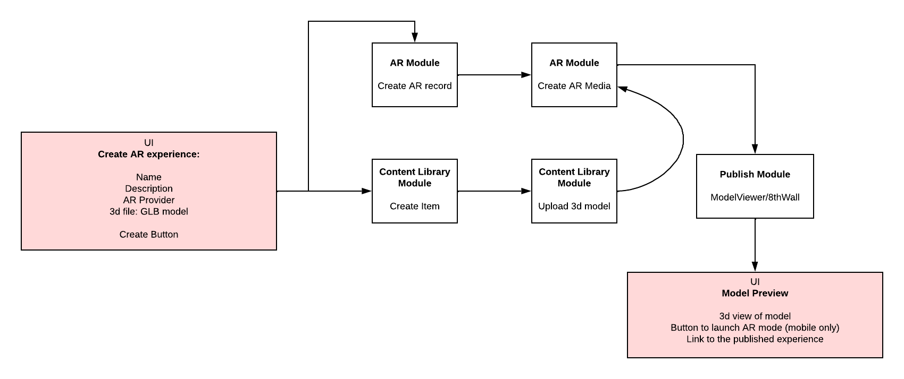

# Appearition Model Viewer: NextJs

A sample project demostrating how to use the Appearition platform modules for creating and publishing web augmented reality experiences with NextJs.

<!--  -->


### Getting Started

1. Clone the project
2. Rename `.env.example` file to `.env.local` and add the following values:

```bash
NEXT_PUBLIC_ApiToken= //The auth token you created while registering the application.
NEXT_PUBLIC_Tenant=   //The tenant name of your developer account. This is the name you used when you signed up.
NEXT_PUBLIC_ChannelId=  //The channel id or project id in the settings page.
NEXT_PUBLIC_ApiRootUrl= // API root URL
NEXT_PUBLIC_AppId= // The application id of your registered application.
```

3. Run the development server:

```bash
npm run dev
# or
yarn dev
# or
pnpm dev
```

Open [http://localhost:3000](http://localhost:3000) with your browser to see the result.

4. The functions with APIs for uploading and retrieving assets are in `utils/Appearition.js` file. You can use these functions to integrate the content library module in your application.

### Flow Diagram



### Troubleshooting

1. Make sure you have registered an application on your Appearition platform account
2. Make sure you generate an API Token for your registered application
3. Assign the following roles to the registered application:
   - InternalContentLibraryCreator
   - InternalContentLibraryEditorAll
   - InternalContentLibraryViewerAll
   - ArCreator
   - ArPublisher
   - ArViewerAllPublished
   - ArViewerAnonymous
   - ChannelAccessAll
   - UserManager
4. Assign your channel to the registered application.

### Deploy on Vercel

The easiest way to deploy your Next.js app is to use the [Vercel Platform](https://vercel.com/new?utm_medium=default-template&filter=next.js&utm_source=create-next-app&utm_campaign=create-next-app-readme) from the creators of Next.js.

Check out our [Next.js deployment documentation](https://nextjs.org/docs/deployment) for more details.
